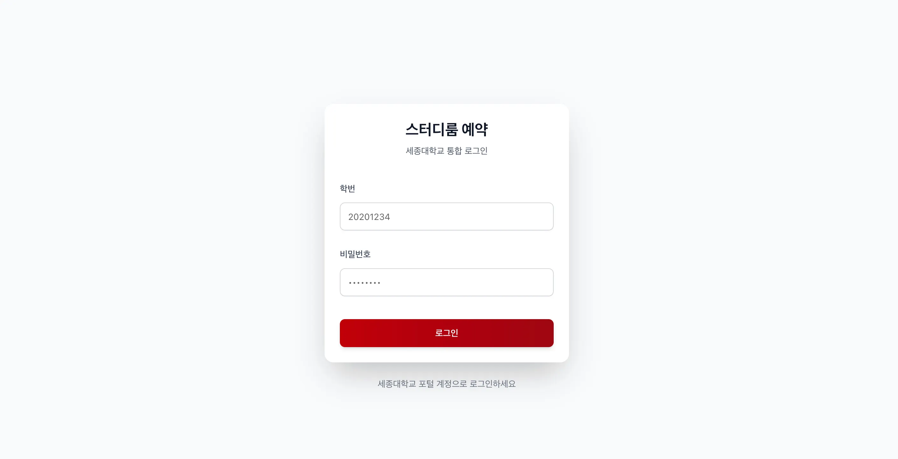
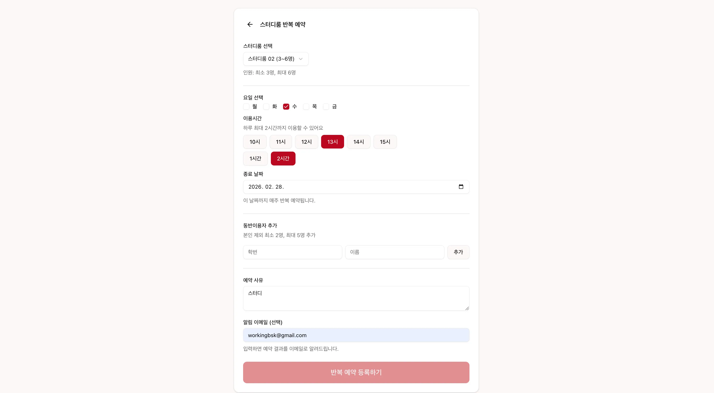
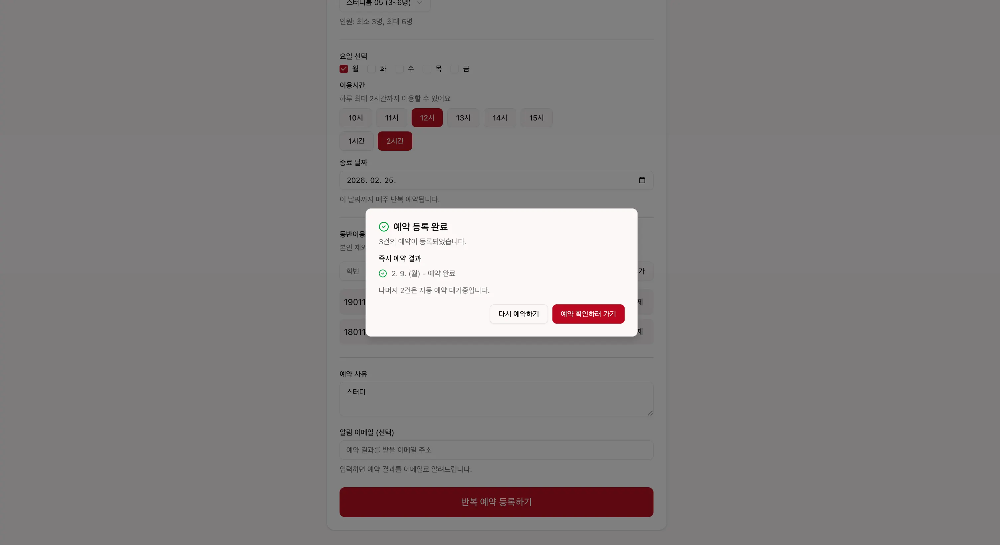
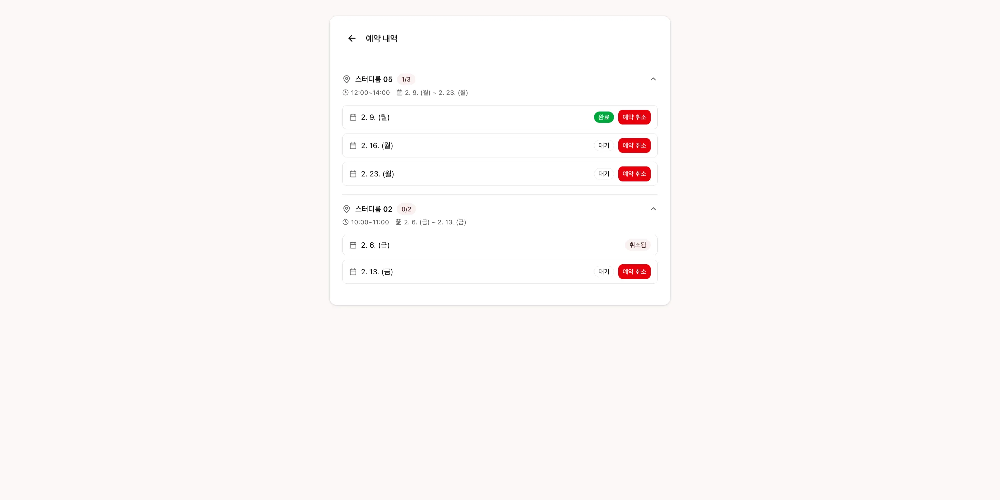

# SE-MAC

SE-MAC은 세종대 학술정보원 스터디룸을 자동 예약할 수 있는 시스템입니다. 매주 같은 스터디룸을 수동 예약하는 번거로움을 해결하고자 만들어졌습니다. 세종대 학생들만 이용할 수 있는 서비스입니다.

> [!IMPORTANT]
> 사용을 위해선 세종대학교 포털 사이트에서 개인정보 수집 동의가 되어있어야 합니다.

## 주요 기능

### 📌 회원가입 필요없는 세종대 학사정보시스템을 이용한 로그인

- 따로 회원가입 필요없이 세종대 학생이라면 **세종대 포털 학번/비밀번호를 통해 로그인** 할 수 있어요.
  

### 📌 설정한 종료일까지 스터디룸을 반복하여 예약과 알림

- 설정한 종료일까지 스터디룸을 반복해서 예약할 수 있어요.
- 동반 이용자 추가는 세종대 학생만 추가할 수 있어요.
- 알림받으실 이메일을 입력해주시면 예약 결과를 이메일로 전달해드려요.
  
- 등록하신 첫 예약일이 당장 예약 가능하다면 바로 학술정보원 스터디룸에 예약하고 있어요.
- 예약이 완료되면 즉시 예약 결과와 전체 예약결과를 같이 볼 수 있어요.
  

### 📌 간편한 예약 내역 확인과 예약 취소

- `완료` : 세종대 학술정보원 시스템에 예약 완료되었음을 의미해요.
- `대기` : 예약을 대기 중이며 예약은 예약날짜로부터 일주일 전 자정에 이루어져요.
- `취소됨` : **예약취소** 버튼을 통해 취소할 수 있으며 대기중/완료된 예약 둘 다 취소할 수 있어요.
  
